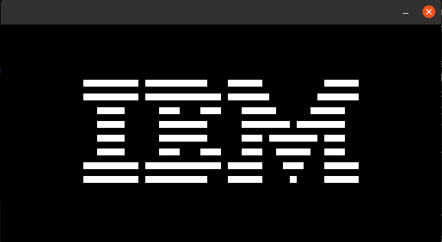
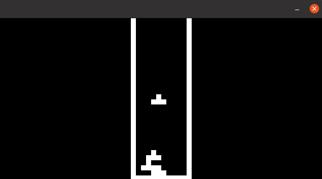

# EmuWars: A CHIP-8 Emulator

**Annabelle Platt**

## Goals:
The goal of this project was to build a [CHIP-8 Emulator](https://en.wikipedia.org/wiki/CHIP-8) virtual machine that can play Pong and other 8-bit games. 

My lower bound for this project were a functional CPU and basic graphics that can decode, execute, and appropriately display the 35 CHIP-8 opcodes. My middle goal, which I'm reasonably confident I can reach, is taking user input. My stretch goals are to add [Super CHIP-8 opcodes](https://en.wikipedia.org/wiki/CHIP-8#CHIP-8_extensions_and_variations) and increase the display size (Super CHIP-8 is a later system with slightly more functionality and a bigger display). My super stretch goal, if everything else gets accomplished, would be to include audio. 

## Learning Goals 
My learning goals for this project were to become more comfortable with C on the hardware level and to have a visual component to the project. 

## Useful Resources: 
I leaned most heavily on the following three resources: 
* [Guide to Making a CHIP-8 Emulator](https://tobiasvl.github.io/blog/write-a-chip-8-emulator/#3xnn-4xnn-5xy0-and-9xy0-skip): this was incredibly useful for conceptual explanations, and as I got more comfortable with bitwise operations I relied on this source more as a guide for the opcodes. 
* [Building a CHIP-8 Emulator (C++)](https://austinmorlan.com/posts/chip8_emulator/): this source was incredibly useful for actual hard code. As it was written in C++ I had a sufficient challenege in figuring things out myself and always used my own judgement in terms of design decisions, but particularly in the beginning as I was getting comfortable with bitwise operations, it was very helpful to have a guide with concrete code. 
* [David Matlack's C implementation](https://github.com/dmatlack/chip8/blob/master/roms/games/Tetris%20%5BFran%20Dachille%2C%201991%5D.ch8): this was another CHIP-8 emulator written in C on Github. I used it mostly to see alternative code explanations, but it's organized very differently from mine and uses a differnet graphics library. 

## What I Accomplished 

I have nearly succeeded in my lower bound of making a functional CPU that can run CHIP-8 games, as well as take user input. 

The emulator can run the IBM logo program, which is a small CHIP-8 program that tests logic, timing, and a few opcodes. You can see the output below: 

The emulator can also *almost* run Tetris - that is, it can run, and it mostly works, but it also runs into "opcodes" it hasn't seen before. As these do not translate to any known opcode, I suspect one or two of my opcodes has a small bug which is causing things to not be where they should be in memory and causing the programs to grab garbage instead of opcodes. It's doing it consistently, however, and mostly still able to execute the program, which means it should be only one or two opcodes. I suspect it will only take an hour or two of debugging to get them working, which I intend to do once the project is over. The main logic loop, graphics, key presses, and the rest of the opcodes all work great. See a Tetris screenshot below: 

## Design Decisions
The biggest decision I had to make (which actually turned out to be a series of small decisions) was how best to structure the project. I knew from the outset that this would be a multi-file project. I also knew that everything had to interact with everything else - the opcodes had to be able to interact with the CPU structures, the main loop had to see them both, and the graphics had to be able to display the screen in the CPU as well. 

If I were using C++, I would have just made a class, where the CPU data structures were attributes and the opcodes were methods. However, I wanted to challenge myself to work outside of object oriented programming this time (and having said that, now that I've done a medium-size project without OOP I am all set and don't need to do it ever again. If I were to build another emulator I would definitely use C++ so I could use classes).  What I ultimately ended up doing was defining the CPU structures in their own file, then declaring them as externs in the header file. I think made another file with a function for each opcode, which directly modified those global variables, like so: 

All the variable were defined in `chip-8.c`
    
    chip-8.c

    #include "chip-8.h"

    // define the external variables here
    uint16_t PC = START_ADDRESS; 
    uint16_t opcode = 0;
    uint16_t I = 0;
    uint16_t stack_pointer = 0;

    uint8_t memory[MEMORY_SIZE]; 
    uint8_t display[SCREEN_WIDTH*SCREEN_HEIGHT];
    uint16_t stack[16];
    uint8_t keys[16];
    uint8_t V[16];

    uint8_t delay_timer = 0;
    uint8_t sound_timer = 0;

Then, in the header file `chip-8.h`, they were declared as externs, for example: 

    extern uint16_t opcode; // shorts are two bytes, so are opcodes

The file `opcodes.c` then included `chip-8.h`, so it had access to those global variables and could modify them directly: 

    #include "chip-8.h
    // Jump to location nnn in memory
    void op_1nnn() {
        // Mask to grab only the last three bytes of the opcode
        // then set the program counter to that address 
        PC = opcode & 0x0FFF;
    }

The main logic loop in `main.c` would then include both the chip-8 and the opcode header files, so it could access both the variables and the opcode functions. I could have skipped making each opcode a function and just implemented the opcode logic in a big switch statement in the main loop. However, I felt that segmenting the opcodes would make them more modular, and ultimately be better for my learning and more readable. 

While I know that modifying global variables directly can be sketchy, my project seemed of a scale that it could feasibly work and for me it was the easiest way to share code. I was careful to make sure each extern was defined only once, and it worked well. 

## Reflection
In terms of scope for this project, I achieved my lower goals and one of my upper goals with taking user input, which is about where I realistically expected to land. I think this project did a great job with meeting my learning goals. I wanted to become more comfortable with C on a hardware level, and I feel like I not only did that, but I got an idea of how code works alongside hardware to run programs. The ideas of decoding information from opcodes, fetching and storing information from registers, writing and reading to and from memory, and so on, all feel demystified to me. 

This project was also perfectly scoped for me at this point in the class, as it covered entirely material we learned in class, but in more depth than we went over it. Bitwise operations are one big example. Througout the course of this project I went from not understanding the application of bitwise operations on a practical level, to comfortably using them to manipulate data in the CHIP-8 CPU. This is another reason I segmented the opcodes into their own functions. Each one was like a little puzzle to solve. Each opcode does one specific, bite-size task, and most involved bitwise operations. For example, opcode `1nnn` jumps to location `nnn` in memory. The implementation is very simple if you know your bitwise operators: 

    // Jump to location nnn in memory
    void op_1nnn() {
        // Mask to grab only the last three digits 
        // then set the program counter to that address 
        PC = opcode & 0x0FFF;
    }

Here we use the bitwise AND operator to isolate only the last three digits of the opcode, then set the program counter to that address. Using 1s with an AND operation to isolate specific bits is known as masking, and I used it in every single opcode because that's the point of an opcode - they contain information that must be decoded, usually by masking off certain parts. While we touched on masking in class, I didn't understand why it would be useful or how it would be applied practically until I worked with it several dozen times. Likewise with shifting. One of the most common lines I used was the following: 

    uint8_t reg = (opcode & 0x0F00) >> 8;

This uses a mask to grab 4 bits, then shifts them over by a byte so that they are the correct order of magnitude. Shifting is something that I feel is often explained confusingly, but seeing it in action and finally understanding a) why it works and why it acts as divison or multiplication and b) why you would ever want to do it in the first place, really hit home for me. I feel so powerful. I can control bits. I can manipulate them and make them do whatever I want. 

Having said all this, my other learning goal was to have a visual component to my project. Although my project did have a visual component, and I got to work with SDL and spend a solid several hours deciphering their pixel encoding values, I don't feel like that took up as much headspace for me as I initially thought it would. It would have been nice to work on something with color and get to work more in depth with graphics, but for this project I really focused in on the hardware side and spent less time on the graphics side, and I think that was a good decision for where I am in my learning at the moment. 

## Concluding remarks
This was such a fun project, and I learned so much. I might be slightly addicted to emulator building and hope to build more complex ones in the future. I plan on fully debugging this one and playing some proper Tetris or Pong. There's also definitely places where my code could be optimized (include guards, something other than a giant switch statement for input processing, making it cross platform), so that could be another avenue to pursue.  

## Link to project
https://github.com/olincollege/SoftSysEmuWars 